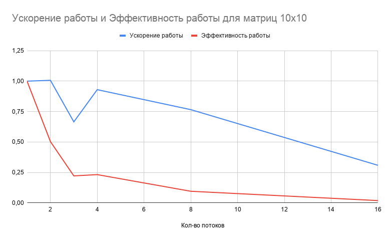
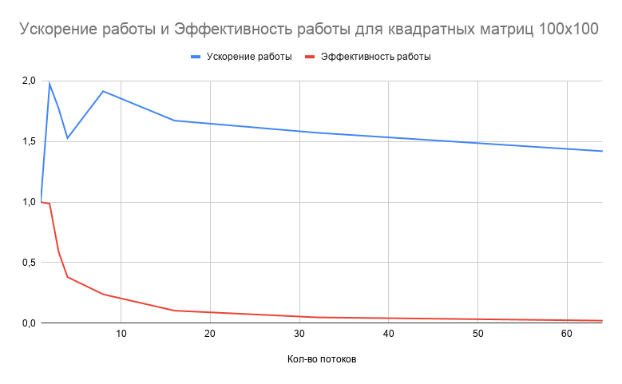

# os_lab_3

### Постановка задачи

#### Цель работы

Приобретение практических навыков в

- Управление потоками в ОС;
- Обеспечение синхронизации между потоками.

#### Задание

Требуется составить многопоточную программу на языке Си, которая:

- Производит перемножение 2-ух матриц, содержащих комплексные числа;
- Количество потоков указывается в виде аргумента запуска программы.

---

### Общие сведения о программе

Для создания многопоточной программы нужно использовать заголовочный файл pthread. Также необходимо указать линковщику ключ -pthread.

Исходный код включает следующие файлы:

- main.c - содержит точку входа, общий алгоритм;
- matrix.c, matrix.h - определяют тип данных “Matrix”, а также функции для работы с ним, в том числе многопоточное
  перемножение;
- io.c, io.h - так как запрещено использовать абстракции над системными вызовами ввода и вывода, здесь реализованы
  более высокоуровневые функции ввода-вывода;

Функции thread, которые я использовал:

- int pthread_create(pthread_t *thread, const pthread_attr_t *attr, void *(*start)(void *), void *arg), где thread -
  указатель для хранения идентификатора созданного потока, attr - атрибуты потока, start - функция, которая запустится
  в новом потоке, arg - аргументы для потоковой функции. Данная функция вернет ненулевое значение, если произошла
  какая-то ошибка, иначе - 0. Данная функция создает и запускает поток;
- int pthread_join (pthread_t THREAD_ID, void \*\* DATA), ожидает завершения потока с идентификатором THREAD_ID, DATA
  указывает, куда нужно записать возвращаемое значение, если он равен NULL, то возвращаемое значение игнорируется.
  Функция возвращает 0, если выполнилась успешно, ненулевое значение - возникла ошибка.

---

### Общий метод и алгоритм решения

Алгоритм многопоточного умножения матриц:

1. Распределить нагрузку по потокам. Я решил распределять строки итоговой матрицы;
2. Для каждого потока найти строчки, которые он будет вычислять. Запустить поток;
3. Дождаться завершения каждого потока.

Для реализации поставленной задачи необходимо:

1. Изучить системные вызовы, которые указаны выше.
2. Разбить задачу на подзадачи:
   - Работа с комплексными числами:
     - Ввод, Вывод
     - Операции над ними
   - Работа с матрицами:
     - Ввод, Вывод
     - Многопоточное перемножение
   - Тестирование
3. Исследование ускорения и эффективности алгоритма от входных данных и кол-ва потоков
4. Рефаторинг кода.
5. Провести тестирование программы. Если были обнаружены ошибки – вернуться к 3-му пункту.

---

### Исследование ускорения и эффективности алгоритма от входящих данных и кол-ва потоков

Процессор, на котором производилось исследование: Intel(R) Pentium(R) CPU 3550M @ 2.30GHz (2 ядра, 2 потока)

Сразу следует сказать, так как я распределяю строчки целиком, то при малом количестве строк, но при большом кол-ве столбцов, мой алгоритм будет показывать плохие результаты.

Si - ускорение времени работы на i потоках относительно времени работы однопоточного решения. Si = T1/Ti

Ei - эффективность работы i потоков. Ei = Si / i

Я делал 4 замера времени работы 1, 2, 3, 4, 8, 32 и 64 потока(ов) и брал среднее значение. Затем я строил соответствующую таблицу.

#### Рассмотрим перемножение двух матриц размером 10x10:

Как видно по таблице, при перемножении маленьких матриц, эффективность потоков очень маленькая. И решение работает на одном потоке лучше, чем на нескольких. Это происходит из-за того, что процесс создания потоков и их поддержка не являются бесплатными, а полезное время работы этих потоков достаточно мало.

#### Рассмотрим перемножение двух матриц размером 100x100:

Здесь ситуация намного лучше. Так как здесь в 1000 раз больше вычислений, чем в прошлом примере, то доля полезных вычислений выше. Максимальное ускорение 1,97 достигается на двух потоках. Это связано с тем, что процессор, на котором производили тесты, является двухъядерным. При большем кол-ве процессов, начинается конкуренция за вычислительное время, а доля полезных вычислений уменьшается.

---

### Пример работы

    reterer@serv:~/OS/os_lab_3/src$ cat ../manual_test/01.t
    2 2
    1 +0i 0 +0i
    0 +0i 1 +0i
    2 2
    1 +1i 2 +2i
    3 +3i 4 +4i
    reterer@serv:~/OS/os_lab_3/src$ make
    gcc main.c io.c matrix.c -pthread -o lab3
    reterer@serv:~/OS/os_lab_3/src$ ./lab3 2 <../manual_test/01.t
    1.00 +1.00i 2.00 +2.00i
    3.00 +3.00i 4.00 +4.00i

---

### Вывод

Потоки, в отличие от процессов, являются более легкими структурами. Их быстрее создавать и переключать, они занимают меньше памяти. И кроме этого, они имеют общую память. Последнее упрощает взаимодействие между потоками, делает его более быстрым. Но в этом и кроется опасность: нужно очень внимательно разрабатывать многопоточные приложения, так как возможны взаимные блокировки и гонки данных. Нужно понимать, какие функции и структуры данных, операции, являются потоково-безопасными, а какие нет.

Для избежания этих проблем используются множество средств, таких как мьютексы, семафоры, каналы и т.д.

Потоки можно использовать для выполнения фоновых задач, например, автосохранения, или, например, для GUI.
